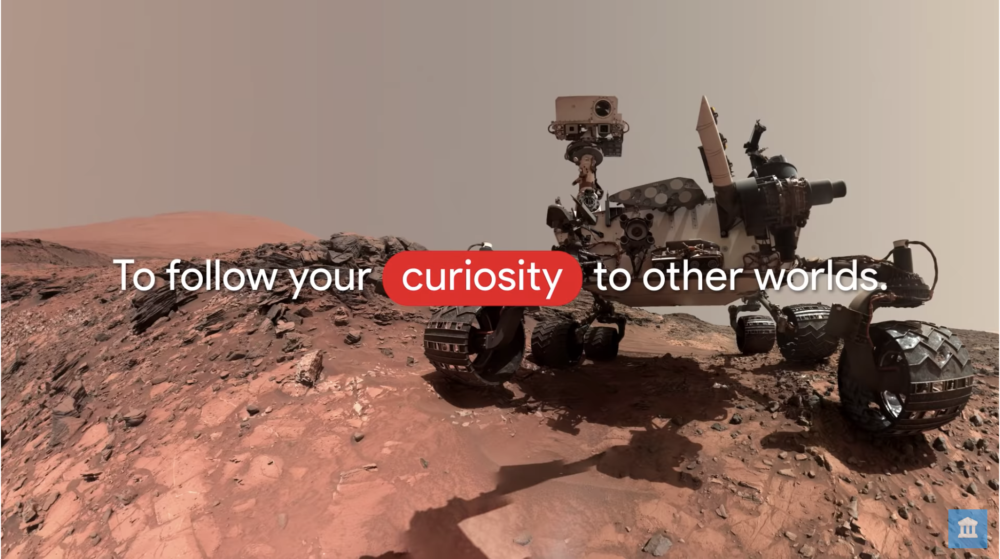

An MIT/IBM AI team trained a GAN on 45,000 portraits to turn your face into impressionist art.  I’m excited by the introduction of neural networks into arts, culture and humanities.  Software will soon be everywhere, in all disciplines.  Last week McKinsey called out software as the top growth industry.  No wonder.
([link](https://aiportraits.com/index.html))

“It may literally be easier to just land Starship on the Moon [in 2 years] than try to convince NASA that we can.”   I expect to see continued, deep partnership between NASA and private industry on the journey to the moon, Mars and beyond.  Inspired chutzpah accelerates change.  Thanks, Elon! ([link](https://time.com/5628572/elon-musk-moon-landing/))

Researchers at UC Irvine created a variant of AlphaGo for solving combinatorial puzzles like Rubik’s cube in seconds
([link](https://www.nature.com/articles/s42256-019-0070-z.epdf))
What’s even more interesting is their use of Code Ocean
([link](https://codeocean.com/capsule/5723040/tree/v1))
for sharing code and compute, built by a company seeking to redefine published scientific research.
The notebook-like platform is free for basic use. Additional compute hours are $1 and
50GB blocks of storage are $5.  Private repos are $20/month.  I just love the simplicity --
a step towards a true cloud IDE for Software 2.0.

Near raised $100M to blend multiple sources of customer data into 1.6B privacy-safe, anonymous,
location-specific profiles.  The company and the article are cagey about how this is done.  If
they’re smart, they’re using tensors to model behavior.  Think of tensors as a neural
encoding of a concept, inspired by how animals represent ideas in their neocortex.  Most of the FANG stocks are doing this.
([link](https://techcrunch.com/2019/07/16/near-raises-100m-for-an-ai-that-merges-online-and-offline-behavior-to-build-consumer-profiles/))

Uber released YAP (yet another platform) for AI.  This one’s for conversational agents.
([link](https://venturebeat.com/2019/07/16/uber-open-sources-plato-for-developing-and-testing-conversational-ai/))

The week was filled with celebrations of the 50th anniversary of NASA’s Apollo 11 moon landing. Feast your eyes on
the AI-powered visualization of NASA data that our Arts & History team at Google built to commemorate this wonderful achievement.
([link](https://experiments.withgoogle.com/nasasvisualuniverse))

Munchies and beer on-demand, as a business.   Where was this when I was in college?
([link](https://www.theinformation.com/articles/softbank-considers-investment-in-delivery-startup-gopuff))

We often talk about AI in healthcare, doing diagnosis, identifying tumors, and the like.  AI is also helpful in extending the reach of preventative care.   This week we heard about an investment in AI-first fitness, using AI to analyze technique in boutique fitness classes like weightlifting, pilates and yoga.  
([link](https://venturebeat.com/2019/07/18/pivot-raises-17-million-for-ai-powered-home-workouts/))
